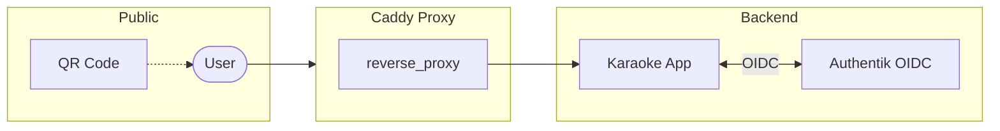
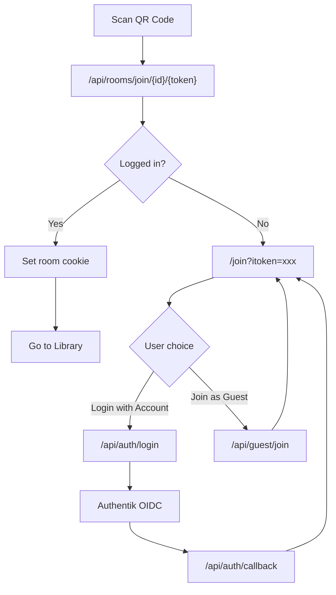

# Architecture

This document describes the system architecture for Karaoke Hydra.

## System Overview

## User Flows

### QR Code Join Flow

## Authentication

The app uses app-managed OIDC with Authentik:

| OIDC Claim | Purpose |
|------------|---------|
| `preferred_username` | User identity |
| `groups` | Role assignment (admin/standard/guest) |

Standard users authenticate through Authentik OIDC. Guest room assignment is handled by app-issued sessions created from validated room invitation tokens, not by proxy headers.

## Components

### Server Stack
- **Koa** — HTTP framework
- **Socket.io** — Real-time queue updates
- **SQLite** — Embedded database
- **sqlite/sqlite3** — SQLite driver

### Client Stack
- **React** — UI framework
- **Redux** — State management
- **Socket.io-client** — Real-time updates

### Infrastructure
- **Caddy** — Reverse proxy (simple passthrough)
- **Authentik** — Identity provider (OIDC)

## Data Flow

1. **Authentication**: User → App → OIDC redirect → Authentik → Callback → App issues JWT
2. **Room Access**: QR scan → Validate token → Set cookie → Route to room
3. **Queue Updates**: Client ↔ Socket.io ↔ Server → Broadcast to room

## Related Documentation

- [Authentik Setup](AUTHENTIK_SETUP.md) — SSO configuration
- [Security](SECURITY.md) — Security model and hardening
- [SSO Overlay Architecture](architecture/sso-overlay.md) — Detailed SSO integration
- [Orchestrator Synthesis UI Style Guide](architecture/orchestrator-synthesis-ui-style-guide.md) — UX rules for Hydra, preset, menu, and future synthesis-control work
- [Orchestrator Preset Operator UX](architecture/orchestrator-preset-operator-ux.md) — Decision spec for Preset operator and Browse-only visual workflows
- [Orchestrator Preview/Output Model](architecture/orchestrator-preview-output-model.md) — Product-language contract for Local Preview, Applied on Player, Player Output, and future Player Live mirroring
- [ADR: Orchestrator Player Live boundary](architecture/orchestrator-player-live-decision.md) — Accepted: Option B (periodic Player-output snapshot) is the target; local-only is the fallback, live mirror deferred
- [Orchestrator Operator & Host Journey + Status-Ownership](architecture/orchestrator-operator-journey.md) — Journey map (browse→…→recover) and the cross-surface status-label ownership contract (Gate 3a-i)
- [Orchestrator HiG Product Interpretation & Visual System](architecture/orchestrator-visual-system.md) — The style direction: Orchestrator as a calm, dense operator workstation; the 9 product-interpretation principles behind the style-guide rules
