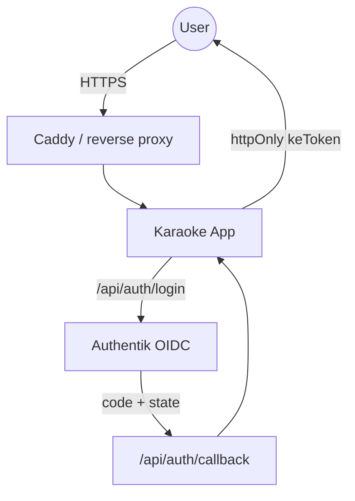
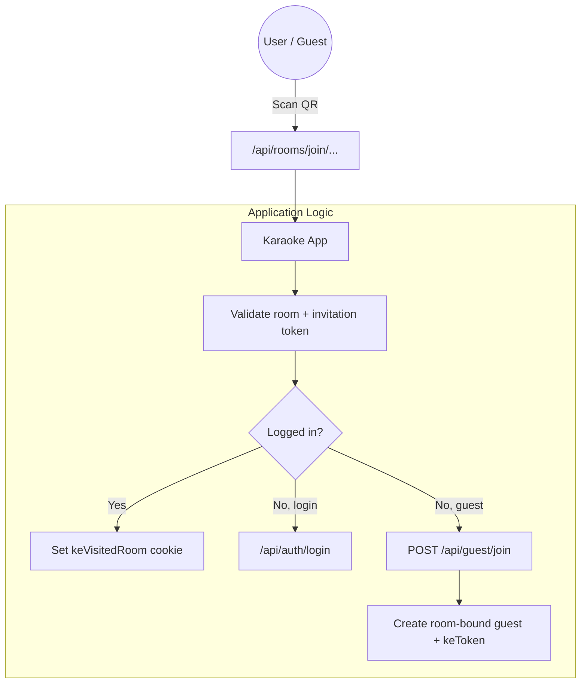

# Architecture: App-Managed OIDC And Smart QR

This document visualizes the current authentication shape. The app, not the reverse proxy, owns authentication and room-join decisions.

## Standard Account Flow
The reverse proxy terminates TLS and forwards requests to the app. The app starts and completes OIDC with Authentik, then issues its own httpOnly `keToken` session cookie.

## Smart QR Flow
The QR endpoint is public, but the app validates UUID invitation tokens before setting room context or creating a guest session.

## Why The App Owns This
1. **Security boundary:** Protected APIs return `401` unless the signed `keToken` is valid.
2. **Room context:** `keVisitedRoom` is only accepted after server-side room validation.
3. **Guest isolation:** Guests are bound to their enrollment room and cannot mutate presets or folders.
4. **Proxy simplicity:** Caddy no longer needs `forward_auth` bypass rules for app routes, sockets, or guest QR flows.
